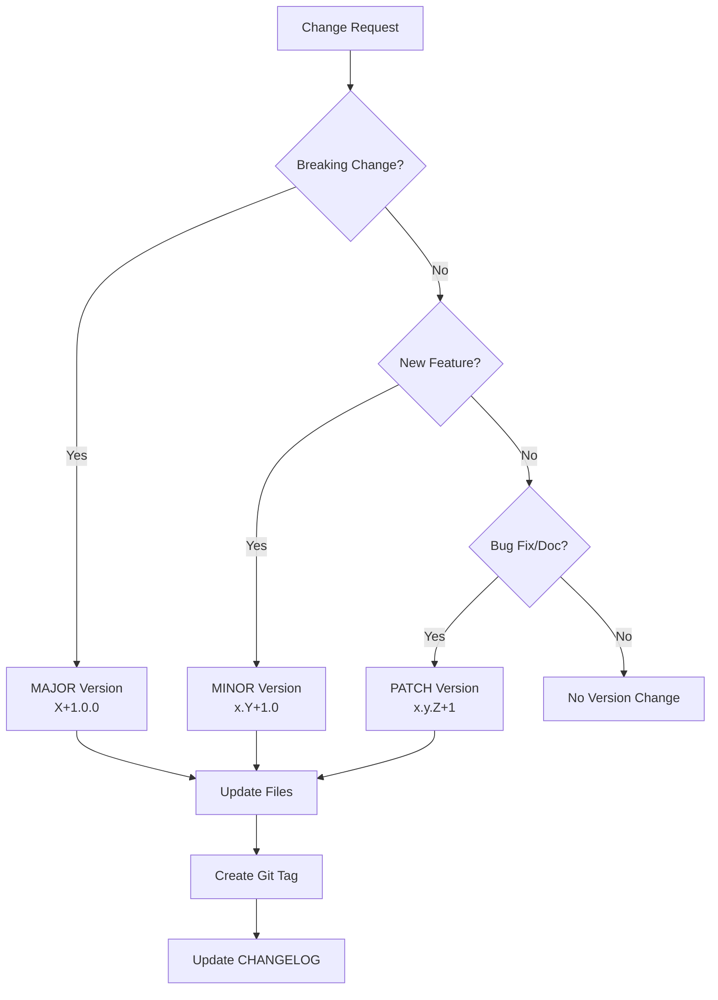

# Version Management Guide for Claude Code Interactions

This document provides automated version management procedures for future Claude Code interactions with the flex-fsk-tx project.

## 🤖 Claude Code Instructions

### Version Detection and Management

When working on this project, Claude should:

1. **Always check current version first**:
   ```bash
   cat VERSION
   ```

2. **Determine version increment type** based on changes:
   - **PATCH** (x.y.Z+1): Bug fixes, documentation updates, small improvements
   - **MINOR** (x.Y+1.0): New features, hardware support, backward-compatible additions
   - **MAJOR** (X+1.0.0): Breaking API changes, major architecture changes

3. **Use the automated version bump script** (see scripts/ directory)

4. **Always create timestamped backups** before major changes

### Automatic Version Increment Decision Tree



### Change Classification Examples

#### MAJOR Version Changes (X+1.0.0)
- Breaking AT command protocol changes
- Incompatible REST API modifications
- Removal of supported hardware platforms
- Major firmware architecture rewrites
- Changes that require user intervention to upgrade

#### MINOR Version Changes (x.Y+1.0)
- New firmware versions (v4, v5, etc.)
- New hardware platform support
- New AT commands or API endpoints
- New features (e.g., message scheduling, encryption)
- New interfaces (e.g., Bluetooth, LoRaWAN)
- Enhanced capabilities that don't break existing functionality

#### PATCH Version Changes (x.y.Z+1)
- Bug fixes and stability improvements
- Documentation updates and corrections
- UI/UX improvements without new functionality
- Performance optimizations
- Configuration enhancements
- Display improvements
- Error message improvements
- Code cleanup and refactoring

### Claude Code Workflow

When making changes, follow this procedure:

1. **Read current version**:
   ```bash
   CURRENT_VERSION=$(cat VERSION)
   echo "Current version: $CURRENT_VERSION"
   ```

2. **Classify the change type** and determine new version

3. **Use version bump script**:
   ```bash
   ./scripts/bump-version.sh [major|minor|patch] "Description of changes"
   ```

4. **Update all version references** automatically

5. **Create git commit and tag**

### Files That Must Be Updated for Version Changes

The version bump script will automatically update these files:
- `VERSION` - Main version file
- `README.md` - Version section and latest changes
- `CHANGELOG.md` - Add new version entry
- `Devices/TTGO LoRa32-OLED/ttgo_fsk_tx_AT_v3.ino` - Firmware version constant
- `Devices/Heltec LoRa32 V3/heltec_fsk_tx_AT_v3.ino` - Firmware version constant
- `Makefile` - Version compilation flags
- `flex-fsk-tx.cpp` - Host application version display

## 🔄 Automated Version Bump Process

### Script Usage

```bash
# For bug fixes, documentation updates
./scripts/bump-version.sh patch "Fix antenna detection bug"

# For new features, hardware support  
./scripts/bump-version.sh minor "Add message scheduling feature"

# For breaking changes, major rewrites
./scripts/bump-version.sh major "Redesign AT command protocol"
```

### What the Script Does

1. **Validates current version** format and git status
2. **Calculates new version** based on increment type
3. **Updates all version references** in source files
4. **Creates timestamped backups** of modified files
5. **Updates CHANGELOG.md** with new entry template
6. **Creates git commit** with standardized message
7. **Creates git tag** with release notes
8. **Displays summary** of changes made

### Pre-commit Validation

Before any version change, the script validates:
- Working directory is clean (or has only expected changes)
- Current version follows SemVer format
- All required files exist and are writable
- Git repository is in good state

### Post-commit Actions

After successful version bump:
- Git tag is created with descriptive message
- CHANGELOG.md is updated with template for new version
- Summary of changed files is displayed
- Next steps for release are shown

## 📋 Claude Code Checklist

When working on this project, always:

### Before Making Changes
- [ ] Read current version: `cat VERSION`
- [ ] Understand the scope of changes planned
- [ ] Classify change type (MAJOR/MINOR/PATCH)
- [ ] Create timestamped backups if needed

### During Development
- [ ] Follow existing code patterns and conventions
- [ ] Test changes thoroughly
- [ ] Update documentation as needed
- [ ] Ensure backward compatibility (unless MAJOR version)

### After Making Changes
- [ ] Run version bump script with appropriate increment
- [ ] Verify all files were updated correctly
- [ ] Check git tag was created properly
- [ ] Update CHANGELOG.md with detailed changes
- [ ] Validate that version references are consistent

### Version Increment Decision Matrix

| Change Type | Examples | Version Increment | Script Command |
|-------------|----------|-------------------|----------------|
| **Breaking Change** | AT protocol changes, API removal | MAJOR (X+1.0.0) | `./scripts/bump-version.sh major` |
| **New Feature** | Message queue, WiFi support, new hardware | MINOR (x.Y+1.0) | `./scripts/bump-version.sh minor` |
| **Bug Fix** | Stability fixes, documentation, UI improvements | PATCH (x.y.Z+1) | `./scripts/bump-version.sh patch` |

### Common Version Scenarios

**Adding new hardware support**:
```bash
# MINOR version - new functionality, backward compatible
./scripts/bump-version.sh minor "Add support for ESP32-C3 LoRa devices"
```

**Fixing transmission bug**:
```bash
# PATCH version - bug fix, no new features
./scripts/bump-version.sh patch "Fix SX1276 frequency calibration issue"
```

**Redesigning REST API**:
```bash
# MAJOR version - breaking change
./scripts/bump-version.sh major "Redesign REST API with v2 endpoints"
```

**Adding message templates**:
```bash
# MINOR version - new feature, backward compatible
./scripts/bump-version.sh minor "Add message template system to web interface"
```

**Updating documentation**:
```bash
# PATCH version - documentation improvement
./scripts/bump-version.sh patch "Update QUICKSTART.md with latest procedures"
```

## 🎯 Integration with CLAUDE.md

This version management system is designed to work seamlessly with the existing CLAUDE.md instructions. Future Claude interactions should:

1. **Always start by checking the version** to understand current state
2. **Use the decision matrix** to classify changes appropriately  
3. **Follow the automated workflow** for consistent version management
4. **Maintain the high quality standards** established in the project

The goal is to make version management completely automatic while ensuring accuracy and consistency across all project files.